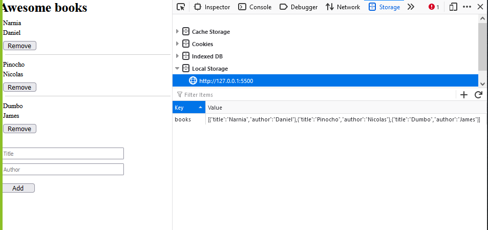

# Awesome Book Project

> In this project we as a team are working on creanting dynamic elements with JavaScript and using the browser localStorage to save the book date.

## Built with
* HTML - CSS
* JavaScript
* GIT/GITHUB

## Project View

## Live page
- checkout the project page: [Awesome-Book]()

## Authors

👤 **Daniel Ufeli**
- Github: [Github](https://github.com/danielufeli)

👤 **Nicolas Gonzalez**
- Github: [Github](https://github.com/Nicolaswg)

## 🤝 Contributing

Contributions, issues, and feature requests are welcome!
Feel free to check leave recommendation in [issues page](https://github.com/Nicolaswg/Awesome_Book_Project/issues)

